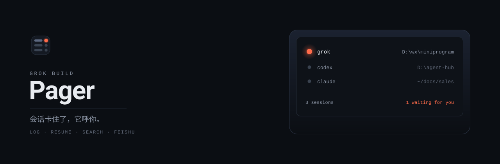
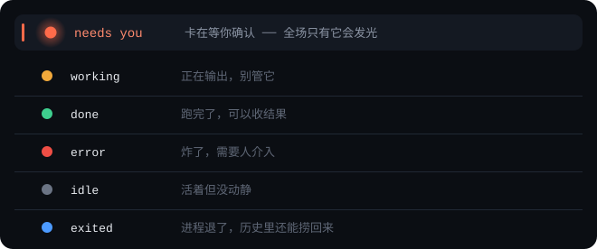
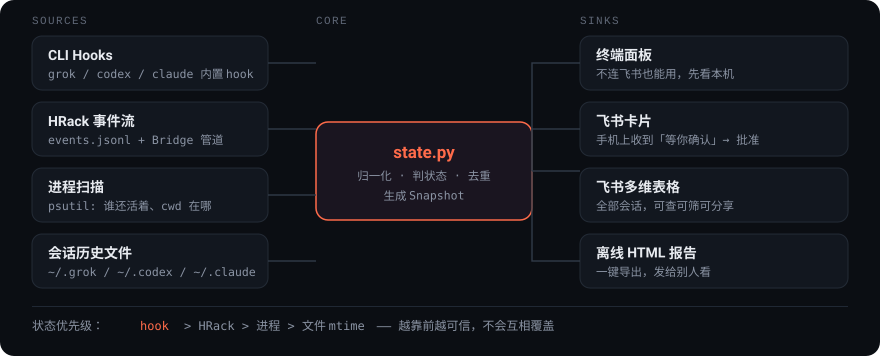

<div align="center">
  
</div>

<h1 align="center">Grok Build Center</h1>

<p align="center">
  <b>Grok Build 会话管理中心 —— 卡住了它主动找你，几百场旧会话也找得回、接得上。</b><br>
  跨项目索引 · 分叉与接续继承 · 带代码漂移检测的恢复。<br>
  哪个会话在等你确认，一眼看到；手机上也能当场放行。
</p>

<p align="center">
  <a href="#快速开始"><b>快速开始</b></a> ·
  <a href="#会话的管理--继承--恢复"><b>管理 / 继承 / 恢复</b></a> ·
  <a href="docs/brand.md">设计规范</a> ·
  <a href="#已知没做的">已知限制</a>
</p>

---

## 你大概遇到过这个

同时开了六个 Grok Build。去泡了杯咖啡，回来发现：

- 一个卡在 **「要不要删掉这 3 个文件」**，已经等了 4 分钟
- 一个早就跑完并退出了，你还以为它在干活
- 一个报错死了，你没看见
- 剩下三个正常，但你不敢确认

**问题不是「没有工具」，是没有地方能一眼看全。**
`~/.grok/sessions` 里躺着几百场会话，但没有任何东西告诉你「现在哪一场需要你」。

这个中心就是干这个的：**把所有会话收在一个地方，然后让卡住的那场主动找你。**

> **为什么叫「中心」而不是「呼机」**：这项目原来叫 `grok-build-pager`，
> pager（传呼机）这个比喻其实很准 —— 但现在用户遇到问题时搜的是
> `grok build session manager`，**没人会去搜一个比喻**。
> 要么名字就是用户会打的词，要么你有推广预算去教育他。我们没有预算。
>
> 但那条产品原则留下来了，它跟名字无关：**仪表盘要你盯着它，而这个东西不该占用你的注意力，
> 只在该打断你的时候打断你。**

---

## 它长这样

<div align="center">
  
</div>

**珊瑚色 `#FF6B4A` 是唯一会发光的颜色。** 它出现的时候，就是你现在最该去看的那一场。
其余五个状态只以实心圆点出现，不带光晕 —— 光晕是稀缺资源，滥用之后「一眼抓到重点」就没了。

（这套视觉为什么这么定，全在 [`docs/brand.md`](docs/brand.md)。）

### 状态从哪来，可信度不一样

这点不藏着：

| 状态 | 来源 | 可信度 |
| --- | --- | --- |
| 🟠 等你确认 / 🔴 报错 | CLI 的 hook 主动上报 | 最准，但要配 hook |
| 🟠 等你确认 | **外部事件流里的 `blocked`**（可选，默认关） | 同样准，且**不用配 hook** |
| 🟢 在跑 / ⚪ 空闲 | 扫进程表，按 (CLI, 目录) 匹配 | 能确定「活着」，不知道它在等什么 |
| · 已结束 | 会话文件的最后活动时间 | 只反映时间 |

> **诚实说明**：不配 hook、也没接上那条可选的外部事件流，面板上就永远不会有橙色的「等你确认」。
> 那个信息只有 CLI 自己知道，别指望从文件 mtime 猜出来 ——
> **猜出来的东西会让你在关键时刻判断错。**

---

## 数据流

<div align="center">
  
</div>

四个数据源合并成一张快照，**状态优先级：hook > 外部事件流 > 进程 > 文件 mtime**。
越靠前越可信，不会互相覆盖。

---

## 会话的管理 · 继承 · 恢复

「卡住了它主动找你」管的是**当下**。真正每天都在疼的是**长期**：
几个月下来 `~/.grok/sessions` 里躺着几百场会话 —— 你记得做过，但**找不到、接不回、也不敢接**。

grok 自己的 `grok sessions list | search | delete` 和 `session_search.sqlite`（FTS5 索引）
其实**都在**。但实测（2026-09-28，本机 51 场会话）有三个硬伤：

| | `grok sessions list -n 8` | 本项目 `tools/sessions.py list` |
| --- | --- | --- |
| 耗时 | **5.3 秒**（每次拉起 leader 进程） | **17 毫秒**（只读 `summary.json`） |
| 范围 | 只列**当前目录**的会话 | 跨全部 24 个工作目录 |
| 中文检索 | `search 小程序` → **超时，返回 0 条** | 正常命中 |

所以这一层只做一件事：**把 grok 已经做好、却埋在 CLI 里的能力挖出来，跨项目聚合、毫秒级呈现。**
全部只读，不动 grok 任何文件。

### 管理：跨项目会话目录

`summary.json` 里 grok 自己写了一堆元数据，但现存工具基本只读了标题和时间。
这里全部挖出来：

| 字段 | 有什么用 |
| --- | --- |
| `last_recap` / `last_turn_summary` | **grok 自己压缩出的会话回顾** —— 恢复时最值钱的两个字段 |
| `head_commit` + `head_branch` + `git_remotes` | 这场会话是在**哪个代码版本**上做的 |
| `current_model_id` / `agent_name` | 用的什么模型、什么 agent |
| `num_chat_messages` | 真实对话轮数（`num_messages` 混了 reasoning，不能用） |
| `~/.grok/active_sessions.json` | **正在运行**的会话 —— 含 pid，过了存活校验才算数 |

```cmd
python tools\sessions.py list --recap -n 30
python tools\sessions.py search 云函数 部署        :: 空格 = AND
python tools\sessions.py list --project 小程序 --not-empty
```

### 继承：分叉，或把上下文交给一场新会话

**两条路，解决同一个问题：不想在旧会话上接着开。**

`--fork-session` 是 grok 原生的 —— 从任意一场会话岔出去试新方向，**原会话一个字不改**。
适合「想试另一条路，但别弄脏现在这版」。

**接续（handoff）** 解决的是一个更硬的约束：

> 恢复的代价跟历史长度**强相关且非线性**。实测：60 KB 的会话 **19 秒**回来，
> 1547 KB 的**600 秒仍不返回**。从 60 KB 到 1.5 MB，就是「十几秒」到「十几分钟」。

所以对大会话，`-r` 约等于「点了就卡十几分钟」。而**新会话吃一段 recap 是秒开的**。
`handoff` 把旧会话压成一小段提示词：

```cmd
python tools\sessions.py handoff 01a0bee1 --ask "把发布流程补完"
```

它**只放结论，不放过程** —— recap 已经是 grok 压出来的干货，把 `chat_history`
塞回去只会重新撑爆上下文，等于白折腾。结尾固定一句：

> 先复述理解 → 列 3 件要做的事 → **不要修改任何文件** → 等我确认再动手

因为接续失败最贵的形态，就是 AI 拿着半懂的状态直接改文件。

### 恢复：点之前就知道要等多久

```cmd
python tools\sessions.py recover 造书成剧
```

```
  体量：1.2 MB · 135 轮对话
  代码：仓库已经往前走了：会话停在 codex/writer-dream-v7 @ 49528037，
        现在是 codex/writer-dream-v7 @ fa235ee1。AI 记忆里的代码可能已经过时。
  预期：历史很大（1.2 MB），续跑可能要十几分钟
  ! 代码已在会话之后变动，恢复前建议看一眼 diff
```

**代码漂移这件事，grok 自己只写不读。** 它把 `head_commit` 写进了 `summary.json`，
但 `grok sessions` / `--resume` / `--restore-code` 里**没有任何一处拿它跟现在的仓库比过**。
后果很实在：你三天后 `-r` 继续一场会话，
如果这期间仓库已经往前合了 20 个提交，AI 是在**它记忆里的旧代码**上做判断 ——
它说的「这个文件里有 X 函数」可能早就不成立了。

（同类工具里有没有人做这件事，我没逐个读过源码，不敢替你打包票。我只能说：
`grok-app`、`cc-sessions-viewer`、`agent-sessions` 这几个的描述里都没提到它。
**对比 ≠ 覆盖**，别拿这句当结论。）

真需要回到当时的代码，grok 原生支持**连代码快照一起恢复**：

```cmd
python tools\sessions.py restore-code 01a0bee1
```

`--restore-code` 有个坑：**必须配 `--worktree`，单独用会被直接拒绝** ——

```
Error: --restore-code on a remote session requires --worktree
(refusing to check out snapshot code into the current directory)
```

这不是限制，是保护：它**永远不往你当前目录里签出**，而是把快照铺到一个新 worktree，
你手头没提交的改动不会被冲掉。本工具会自动把 `-w` 补上。

### 两张离线 HTML，管两件事

```cmd
python tools\sessions.py html -o sessions.html        :: 会话管理台（这个）
python -m feishu_hub.scan --out session-history.html  :: 全文检索页
```

| | 会话管理台（`sessions.py html`） | 全文检索页（`scan.py --out`） |
| --- | --- | --- |
| 回答 | 「这些会话现在什么状态、该恢复哪一个」 | 「那件事到底在哪场会话里说过」 |
| 覆盖 | 只 grok，但字段最深（recap / 漂移 / 在跑 / 体量） | 跨 4 家 CLI |
| 装什么 | **不嵌正文**，卡片式，带可复制的恢复命令 | 嵌入每场最多 12000 字正文，表格 + 全文搜索 |
| 视觉 | 珊瑚品牌色，只有在跑那一场发光 | 中性蓝，表格优先 |

管理台纯本地、**零外链**（断网、丢进邮件附件都能看），自带搜索框。
珊瑚色**只给正在运行的那一场**；代码漂移这类警示走中性琥珀，不跟那颗灯抢注意力。

---

## 快速开始

```cmd
git clone https://github.com/dragon43pp/grok-build-center.git
cd grok-build-center
pip install -r requirements.txt

python tools\setup.py        :: 向导：验凭证 → 建多维表格 → 拿 open_id → 写 config.json
run.cmd                      :: 启动
```

### 不想连飞书？先看本机

飞书是**可选的外挂**，不是前提。这几条全离线：

```cmd
run.cmd --print                            :: 本机状态表格（最快看到效果的一条）
python tools\sessions.py --recap           :: 跨项目会话目录（17 毫秒扫完全部）
python tools\sessions.py drift             :: 哪些会话的记忆已经跟代码对不上了
python tools\sessions.py html -o a.html    :: 离线 HTML 报告，断网可看
python -m feishu_hub.feed                  :: 看外部事件流通道接上了什么（可选）
python tools\smoke_test.py                 :: 296 项离线自检，不联网不建应用
python tools\card_preview.py               :: 生成 card-preview.html，浏览器打开，按钮能点
```

**先跑 `run.cmd --print`。** 它不联网、不需要任何配置，
直接把本机所有会话和状态列出来。看到这张表，你就知道这东西值不值得配飞书。

---

## 三个界面，各管一段

| | **终端 / `--print`** | **飞书常驻卡片** | **飞书多维表格** |
| --- | --- | --- | --- |
| 定位 | 本机一眼看 | 手机上看 + 当场动手 | 完整清单 |
| 放什么 | 全部会话 | 最要紧的几条 | 全部会话，15 列 |
| 能干什么 | 看状态、看目录 | 筛选 / 详情 / 打开 / 投喂 | 原生筛选 / 排序 / 搜索 / 分组，**可分享** |
| 翻页 | 一屏 | 一页 10 条 | 无限滚 |

几百场会话在卡片上要翻几十页，手机上点到手酸。所以**表格才是「看全部」的地方**，
卡片负责「现在哪几件要紧事 + 一键回到现场」。**两个都免费。**

第四个视图是**离线 HTML 报告**（`python tools\sessions.py html`）——
它不是「现在」，而是「这些日子」：全部项目、全部会话一页摊开，带搜索框，断网也能看。
飞书卡片有 30 KB 上限、多维表格要联网，只有它能塞进邮件附件发给别人。

### 卡片上能干什么

| 操作 | 效果 |
| --- | --- |
| 筛选（活跃 / 等你确认 / 各家 CLI / 全部） | 换筛选，原地刷新 |
| **详情** | 另发一张卡：这场会话的**最近 10 轮对话正文** + 输入框，可以直接发指令让它继续 |
| **打开** | 用 Windows Terminal 在该会话的目录里执行 `grok --resume <id>` 之类的恢复命令 |
| ‹ 上一页 / 下一页 › | 翻页，每页 10 条 |
| ⟳ 刷新 | 后台重扫（约 5 秒），扫完自动 PATCH 回来 |
| 批准 / 拒绝 | 放行卡住的会话（要 `feed_approve=true`，且接了控制管道） |

---

## 外部事件流（可选，默认关）：不用配 hook 就有「等你确认」

上面那句「不配 hook 就没有橙色」有一个例外：**如果本机已经有一个会话管理器
自己在记「哪场卡住了」，那就不用你配 hook。**

这是个**通用适配器**，不是为某一家写的。它对接口只提两个要求：
① 一个 append-only 的 JSONL 事件流水；② 可选的一条命名管道做反向操作。

```
<你在 config.json 里指的 feed_events>
  session_start  detail = 工作目录
  tool_call      正在干活
  blocked        ← 卡在等你批准 / 等你回答
  approved       放行了
  completed      一轮结束
  session_exit   进程退了
```

**默认关闭，而且这个仓库里不写死任何路径。** 想接就在 `config.json` 里指过去：

```json
{
  "feed_enabled": true,
  "feed_events": "C:\\某个会话管理器\\events\\events.jsonl",
  "feed_pipe":   "\\\\.\\pipe\\某个管道名",
  "feed_token":  "C:\\某个会话管理器\\token"
}
```

自检（没配置就直说没配，不会瞎读文件）：

```cmd
python -m feishu_hub.feed                    :: 看接上了什么
python -m feishu_hub.feed --config config.json
```

### 还能反向操作（控制管道）

配了控制管道之后就不只是「看」了：

| 操作 | 走的方法 | 效果 |
| --- | --- | --- |
| **批准 / 拒绝** | `session.approve` / `session.deny` | 当场放行那场卡住的会话（要 `feed_approve=true`） |
| **投喂** | `session.send` | 把一句话**塞进正在跑的那一场**，不是另起进程 |

「投喂」跟无头续跑是**两条不同的路**，别混：

| | 无头续跑 | 投喂（控制管道） |
| --- | --- | --- |
| 怎么跑 | `remote.py` 另起一个无头进程 | 直接写进正在跑的那一场 |
| 上下文 | 重新加载整段历史，大会话要几分钟 | **连续的**，TUI 里能看到这句话 |
| 适用 | 所有 CLI | 对端愿意暴露的那些会话 |
| 覆盖范围 | 另起炉灶，跟 TUI 那场互不相干 | **同一场会话** |

> **对端的边界不是本项目的限制**：`sessions.list` 返回哪些会话由对端决定
> （比如只放行 opencode），拿不到别的 adapter 不是 bug。事件流水那条路不受影响。

**信任开关默认关着**：`feed_approve: false`。
开着 = 飞书那头点一下就能让你的机器继续执行工具。跟 `remote_auto_approve` 是同一类问题，
想清楚再开。关着的时候卡片上干脆不摆那两个按钮 —— 摆一个点了只会弹「未开启」的，更烦。

**没配 / 对端没开怎么办**：什么都不用做。没配置时整个模块一次系统调用都不发；
配了但读不到就静默降级，面板照常工作。

---

## 顺带支持的其他 CLI

Grok Build 是主角，但同一套东西对旁边几家也生效 —— 它们的会话库格式不一样，
这里给每家各写了一个适配器：

| CLI | 会话库 | 无头续跑 |
| --- | --- | --- |
| **grok** | `~/.grok/sessions/<esc-cwd>/<sid>/chat_history.jsonl` | `grok --cwd <dir> -r <sid> -p "<prompt>"` |
| codex | `~/.codex/thread_history_1.sqlite` → `thread_items` | `codex exec resume <sid> "<prompt>" --skip-git-repo-check` |
| claude | `~/.claude/projects/*/<sid>.jsonl` | `claude -p --resume <sid> "<prompt>"` |
| opencode | `~/.local/share/opencode/opencode.db` | `opencode run --session <sid> "<prompt>"` |
| gemini | `~/.gemini/` | `gemini -p --resume <sid> "<prompt>"` |
| kimi / pi | — | `<exe> -p --session <sid> "<prompt>"` |

> **codex 那个 `--skip-git-repo-check` 不能省。** 不加的话，只要会话目录不是 git 仓库，
> codex 会 **1 秒内直接退出**：`Not inside a trusted directory and --skip-git-repo-check was not specified.`
> —— 我们是回到一场**已存在**的会话，要求它是 git 仓库毫无道理。

> **子进程的 stdin 一定要关掉（`stdin=DEVNULL`）。** 这个坑最阴：不关的话子进程继承我们的 stdin 并
> **等键盘输入**，`grok -r ... -p ...` 会**零输出挂死**，直到超时才炸。
> 看起来就像「grok 不支持无头续跑」。关掉之后同一个命令 19 秒正常返回。
> `smoke_test.py` 里有一条专门钉这个的用例。

**读会话正文时各家的坑**（`remote.read_transcript()`）：

| CLI | 正文在哪 |
| --- | --- |
| grok | 每行 `{"type":"user"\|"assistant","content":"…"}` |
| codex | **`userMessage` 在 `content[]`，`agentMessage` 在顶层 `text`** |
| claude | `message.content[]`，块类型 `text` |
| opencode | `message.data.role` + `part.data.text` |

> codex 那个坑值得单说：只看 `content` 的话，**AI 的回复会全部读成空** ——
> 表现是「只有你说话，AI 从没回过」。因为 `agentMessage` 的正文在顶层 `text` 字段。

---

## 远程续跑：在飞书里把任务接着做下去

问题很实际：手机上点「打开」只会**在本机**弹一个终端，飞书这头看不到后续，也接不上手。
所以加了「详情」这条路径：

```
面板 → 点「详情」→ 一张新卡：会话正文 + 输入框 → 写一句话提交
    → 本机无头续跑这一场 → 结果回传成一张新卡
```

**它不是远程控制终端。** 那几家 CLI 都是全屏 TUI，把 TUI 流到飞书既没法交互也看不清。
但它们都提供**无头单轮模式**（吃一个 prompt、结果打 stdout、退出），
所以「继续任务」的正确形态是**远程投喂一轮**：不碰 PTY，没有窗口尺寸、转义序列、交互式确认这一堆无底洞。

**四个必须知道的约束**：

1. **提交后要等一会儿。** 回调预算只有 3 秒，续跑动辄几分钟 ——
   所以是收到就立刻回你一句「正在本机执行」，跑完再单独发一张结果卡。
   结果卡上会写**实际耗时**，你就能分辨「等这么久是正常的」还是「这次特别慢」。
2. **会话越大，恢复越慢 —— 而且不是线性的。** 实测：56 KB 的 grok 会话首次续跑 **19 秒**；
   1.5 MB 的 **600 秒仍没回来，零输出**。所以详情卡会按体量提前给提示（`remote.size_hint()`）：
   超 400 KB 说「可能要几分钟」，超 1 MB 说「可能要十几分钟，别在这儿等」。
   **大会话建议直接在电脑上打开**，这条路是给「随手接一句话」用的。
3. **默认不自动批准工具执行**（`remote_auto_approve: false`）。开着的话飞书那头就能在本机自动批准改文件、
   跑命令 —— **想清楚再开**。关着也能用，只是只能对话、不能动文件。
4. **结果会被截断。** 卡片上限 30 KB，超了只回前 20 KB（按**字节**算，中文一个字 3 字节）。

> **如果续跑失败，先看是不是模型/额度问题，别先怀疑这条路。**
> 实测过一次：codex **新会话**也失败，报 `404 Not Found: Auto 路由池没有支持该模型的可用分组`。
> 那就是 provider 配置问题 —— 链路已经走到「把 prompt 交给模型」这一步了。
> 判断方法：拿同一个 CLI 开一场**新会话**试试，新会话也挂就是环境问题。

---

## 第一步：建飞书应用（可选）

> 必须是**企业自建应用**。个人版飞书账号也能建，但要有企业/团队空间。

### 最短路径

后台一共要动的只有 **2 个开关**，都在同一页：

| 页面 | 要做的 | 必需？ |
| --- | --- | --- |
| **事件与回调** → 事件配置 | 订阅方式选 **使用长连接接收事件** | ✅ 必需 |
| **事件与回调** → 回调配置 | 订阅方式选 **使用长连接接收回调** | ✅ 必需 |
| 权限管理 → IM | `im:message` | ✅ 必需 |
| 应用发布 → 可用范围 | 把自己加进去 + 发布版本 | ✅ 必需 |
| 权限管理 → 多维表格 | `bitable:app` 一个 + 加 Base 协作者 | ⬜ 可选 |

这两个**长连接开关是后台独有的设置，没有 API 能代开**，只能手动点。
**不用公网 IP、不用服务器** —— 事件和回调都是出站连接。

### 逐步

1. [open.feishu.cn/app](https://open.feishu.cn/app) → **创建企业自建应用**
2. 左侧 **添加应用能力** → **机器人** → 启用
   （没有这一步，后面所有接口都会报 `230006 Bot ability is not activated`）
3. **权限管理** → 加 `im:message`（发卡片、更新卡片，**开这一个就够**）
4. **事件与回调**：事件配置选长连接 + 加 `im.message.receive_v1`；
   回调配置选长连接 + 加 `card.action.trigger`
   ⚠️ 回调要加**新版** `card.action.trigger`，**不要**用已废弃的 `card.action.trigger_v1`
5. **应用发布** → **版本管理与发布** → 创建版本 → **可用范围**里把自己加进去 → **发布**
   > 不做这一步，发消息会报 `230013 Bot has NO availability to this user`。
   > 这个错误码看起来像权限问题，其实是「可用范围」没配 —— 排查时会绕很久。
   > **改过权限之后要重新创建版本并发布**，只加权限不重发版本不生效。
6. ```cmd
   copy config.json.example config.json
   python tools\setup.py
   ```
   向导会问 app_id / app_secret，真调一次接口验证，然后建多维表格、拿 open_id、写配置。

**怎么确认 IM 权限开没开**：不用猜 —— `python tools\probe_im.py` 会用应用身份真发一条消息。

| 错误码 | 真实原因 |
| --- | --- |
| `99991672 app_scope_not_applied` | 应用缺 IM 权限 |
| `230013 Bot has NO availability to this user` | 可用范围没配 |
| `99992351 invalid open_id` | `receive_id` 填错了 |

> 多维表格那段（可选）：加一个 `bitable:app` 就够。**外加一步容易漏** ——
> 应用身份要读写**你个人拥有**的多维表格，还得把这个应用**加进那张 Base 的协作者**
> （打开 Base → 右上角 **分享** → 添加协作者 → 搜应用名 → 给「可编辑」）。
> 不给的话权限开全了也照样 403。

---

## 第二步：跑起来

```cmd
run.cmd
```

看到这些就对了：

```
[ok] 扫到 343 场会话，存活进程 2
[ok] 多维表格已就绪 table_id=tblXXXX
[bitable] 新增 343 · 更新 0 · 删除 0 · 未变 0
[ok] hook 端点监听 http://127.0.0.1:8799/hook
[ok] 面板已发送并置顶 message_id=om_xxxxx
[ok] 建立飞书长连接（事件 + 卡片回调都走这里，无需公网 IP）...
```

### 两种跑法：开发用 .cmd，交付用 exe

| | 开发 / 本机自用 | 交付 / 装到别人机器 |
| --- | --- | --- |
| 需要 Python | 要（3.10+） | **不要** |
| 入口 | `start.cmd`（或开始菜单那条快捷方式） | `GrokBuildCenter.exe` |
| 配置在哪 | 仓库根目录 | **exe 旁边** |
| 怎么来 | `python tools\make_start_menu.py` | `python tools\build_exe.py` |

#### 开发：开始菜单就一个入口

```cmd
python tools\make_icon.py             :: 先生成我们自己的图标（零依赖）
python tools\make_start_menu.py       :: 装进开始菜单（--remove 卸载）
```

点开「**Grok Build Center**」就行，**不用你判断该走哪条路**：

```
config.json 没配好  →  体检模式（离线，不需要任何配置）
config.json 配好了  →  启动飞书面板，飞书里发一张常驻卡片并置顶（窗口别关）
```

体检模式跑 5 步，**第 1 步就是会话库** —— 不是先讲飞书：

```
1/5  Grok 会话库（管理 · 继承 · 恢复）   本机 51 场，按活跃时间列出来 + 每个命令怎么用
2/5  外部事件流（可选，默认关）           没配置就说没配置，配了才报读到了什么
3/5  本机会话快照                        面板上会长什么样（不连飞书也能看）
4/5  自检                                296 项离线检查，扫本机会话库是真机只读
5/5  历史会话网页                        生成单文件 HTML 并直接打开（可搜索、可复制续跑命令）
```

判断是 `tools/config_ready.py` 读 `config.json` 做的，不是问你。
想强制走某一种：`start.cmd --check` / `start.cmd --panel`。

> **改 `.cmd` 之前必须知道的一件事**：这些文件**只能写 ASCII**，中文一律交给 Python 打印
> （见 `tools/banner.py`）。原因是两头堵死：存 UTF-8 → cmd 按 GBK 解析，中文全变乱码
> （本机 ACP 就是 936）；存 GBK → 脚本开头 `chcp 65001` 一执行，echo 出来的 GBK 字节又是乱码。
> 顺带两个一起踩会死得更难看：**`.cmd` 必须是 CRLF**，LF 会让 cmd 把行切碎，
> 报一堆「不是内部或外部命令」。仓库里 `.gitattributes` 已经钉死了这条。

#### 交付：一个 exe + 一个安装包

```cmd
python tools\build_exe.py               :: 全打，约 2.5 分钟
python tools\build_exe.py --app         :: 只打主程序（调 UI 时够用，省一半时间）
python tools\build_exe.py --setup-only  :: 只改了 installer\ 的话用这个（30 秒）
```

产出三样，都在 `dist\`：

| 产物 | 体积 | 怎么用 |
| --- | --- | --- |
| `GrokBuildCenter\GrokBuildCenter.exe` | 21 MB | 免安装：整个目录拷走就能跑 |
| `GrokBuildCenter-Setup.exe` | 43 MB | 安装包：双击就装，也能静默 |
| `GrokBuildCenter-portable.zip` | 35 MB | 上面那个目录的压缩包，方便传 |

**装机版不要管理员**：默认装到用户目录，卸载登记写 HKCU，所以「设置 → 应用」里看得到、卸得掉。
刻意不装 Program Files —— 那要 UAC 提权，而这工具是单人用的，`config.json` 就在程序目录里更好改。

安装包支持静默：

```cmd
GrokBuildCenter-Setup.exe --silent                        :: 默认目录，不问任何问题
GrokBuildCenter-Setup.exe --silent --dir D:\tools\gbc      :: 指定目录
GrokBuildCenter-Setup.exe --silent --no-shortcuts         :: 不建快捷方式
```

**配置在 exe 旁边，不在包里。** 打包后 `paths.data_root()` 就是 exe 所在目录，装完长这样：

```
%LOCALAPPDATA%\Programs\Grok Build Center\
├─ GrokBuildCenter.exe      主程序
├─ config.json.example      复制成 config.json 再填
├─ uninstall.exe            卸载（也可以在「设置 → 应用」里卸）
└─ _internal\               Python 运行库 + assets（PyInstaller 的目录布局）
```

想整体挪走、或者当便携版用：设环境变量 `GROKBUILD_HOME` 指到别处即可。

exe 的子命令跟 `.cmd` 那套一一对应（少了一步 `4/5 自检`，那个是给开发者的，单独有 `doctor`）：

```cmd
GrokBuildCenter.exe                 自动判断：没配飞书 → 体检；配好了 → 面板
GrokBuildCenter.exe check           离线体检（4 步）
GrokBuildCenter.exe panel           启动飞书面板
GrokBuildCenter.exe history         生成可搜索的历史会话网页并打开
GrokBuildCenter.exe sessions list   会话管理，跟 tools\sessions.py 同一套命令
GrokBuildCenter.exe doctor          296 项离线自检
GrokBuildCenter.exe version         版本与目录（排查「配置到底读的哪儿」最有用）
```

> **打包必须用项目自带的 `.venv`**：PyInstaller 会把**当前解释器里装的东西**一起打进去。
> 用系统 python 打出来的包会缺 `lark-oapi`（面板要它），装到别人机器上第一句 `import` 就崩。
> `build_exe.py` 已经硬指 `.venv\Scripts\python.exe`，没有就警告。
>
> 另外两个实测踩过的坑，都写进代码注释了：**`--add-data` 的东西会落在 `_internal\` 里**，
> 不在 exe 旁边（安装器找图标、找 `config.json.example` 都得看那儿）；
> **`--setup-only` 必须连卸载器一起重打**，否则装出来的包带着上一次编进去的旧卸载逻辑 ——
> 这次就是被这个坑到，装完注册表删不掉。

---

## 第三步：配 hook（可选，但强烈建议）

不配 hook 就**只有接了外部事件流、由它拉起的会话**有「等你确认」。配了之后，任何 CLI 卡住都会：

1. 面板上那一条变成橙色 🟠 并排到最前面，多维表格里状态同步变成「等你确认」
2. 飞书主动推一条「有会话在等你」（同一个会话 5 分钟内只推一次，不刷屏）

CLI 的 hook 里调：

```cmd
python tools\report.py --cli grok  --status needs-you --note "要删掉 3 个文件，确认？"
python tools\report.py --cli codex --status needs-you --note "要删掉 3 个文件，确认？"
python tools\report.py --cli grok  --status done
```

`--cli` 不给会从环境变量猜。`--sid` 不给就按当前目录匹配。
**这个脚本永远退出码 0** —— hook 挂在 CLI 主流程上，这里报错绝不能把你的会话搞崩。

各家 CLI 的 hook 配置位置不同，见各自的文档；本质就是在「需要用户确认」和「任务结束」时执行上面这行命令。

---

## 目录结构

```
grok-build-center/
├─ run.cmd                    一键启动
├─ start.cmd                  Windows 开始菜单入口（自动判断体检 / 面板）
├─ offline-check.cmd          体检模式本体：5 步，离线可跑（纯 ASCII + CRLF）
├─ config.json.example        配置模板（复制成 config.json）
├─ requirements.txt
├─ assets/                    品牌资产（SVG 自适应明暗 + prompts.json）
│  └─ icon/                   自己的应用图标（.ico + 各尺寸 png）
├─ docs/brand.md              设计规范（改视觉前先读）
├─ feishu_hub/
│  ├─ scan.py                 扫本机各家 CLI 的会话库 → 统一记录
│  ├─ procs.py                扫存活进程，按 (CLI, 目录) 匹配
│  ├─ groksessions.py         ★ Grok 会话深索引：管理 / 分叉 / 接续 / 漂移 / 体检
│  ├─ feed.py                 ★ 外部事件流通道（可选，默认关）：事件流水 + 控制管道
│  ├─ state.py                历史 + 进程 + 外部事件流 + hook 四源合并成统一快照
│  ├─ paths.py                data_root / bundle_root —— 打包后这俩不是一个地方
│  ├─ cards.py                飞书卡片 JSON 2.0 构造
│  ├─ bitable.py              多维表格：建表 / 增量同步 / 索引重建
│  ├─ feishu.py               发卡片 / PATCH 卡片 / 长连接
│  ├─ launch.py               恢复会话（Windows Terminal）+ 参数校验
│  ├─ remote.py               无头续跑 + 会话正文读取
│  └─ hub.py                  主程序：面板发布、回调分发、hook 端点、后台刷新
├─ installer/
│  ├─ setup_main.py           安装程序（装用户目录 / 不要管理员 / 写 HKCU 卸载登记）
│  └─ uninstall_main.py       卸载程序（自删目录靠一个 ASCII+CRLF 的临时 .cmd）
└─ tools/
   ├─ app.py                  ★ 打包后的统一入口（.cmd 那套的 exe 等价物）
   ├─ build_exe.py            ★ 打包：主程序 + 卸载器 + 安装包 + zip
   ├─ setup.py                一键安装向导（建表 / 拿 id / 写配置）
   ├─ sessions.py             ★ 会话命令行：list / search / recover / fork / handoff / drift / html
   ├─ sessions_html.py        ★ 离线 HTML 报告渲染（零外链）
   ├─ smoke_test.py           296 项离线冒烟测试，不联网不建应用
   ├─ banner.py               .cmd 要打的中文都在这儿（.cmd 里只能写 ASCII）
   ├─ make_icon.py            生成自己的图标（纯 Python，零依赖）
   ├─ make_lnk.py             建 Windows 快捷方式（走 Shell COM，不手写二进制）
   ├─ make_start_menu.py      装 / 卸 Windows 开始菜单入口
   ├─ gen_assets.py           用 gpt-image-2 批量出视觉资产
   ├─ gh_push.py              github.com 被墙时走 API 推送（并复刻 commit SHA）
   ├─ card_preview.py         渲染卡片为可点的 HTML
   ├─ whoami.py               拿 open_id / chat_id
   └─ report.py               CLI hook 上报器（只用标准库）
```

> `feishu_hub` 这个包名是历史遗留（项目原来叫 agent-hub），一直没改 ——
> 改它要动全部 `import` 和 `-m` 调用，收益为零，风险不低。

---

## 自检

```cmd
python tools\smoke_test.py
```

**296 项检查，不联网、不建飞书应用**，把整条链路跑一遍：

- 快照 / 卡片发布 / 筛选分页 / 卡片回调 / hook 端点 / 参数校验
- **外部事件流通道**（可选，默认关）：6 种事件、状态迁移、增量读、压缩重写后重读、坏行跳过、快照合并优先级、僵尸进程
- **多维表格同步的幂等性** —— 这块写错会把 343 行反复插成双份，而且不报错，
  只会在表里慢慢堆垃圾。所以单独测了：原样重同步 0 新增 0 更新、只推变化行、
  会话消失删行、本地索引丢了从表里读回不重插、超批量上限自动分批
- **会话索引**：纳秒时间戳、中文列宽对齐、AND 检索、id 前缀消歧（**歧义必须返回「不唯一」而不是瞎猜**）、
  git HEAD 三种形态（loose ref / packed-refs / worktree 的 `gitdir:` 文件）、
  五种漂移状态、体量分档、正在运行的会话要警告但不阻断、
  `--restore-code` 自动补 `--worktree`、接续提示词必带「不要修改文件」、
  HTML 报告零外链 + XSS 转义

先把代码逻辑钉死，再去连真飞书 —— 这样出问题一定是后台配置的锅。

---

## 飞书的硬约束（写代码时必须记住的）

都是官方文档里明确的，踩过才知道：

| 约束 | 值 | 踩了会怎样 |
| --- | --- | --- |
| 卡片回调响应时限 | **3 秒** | 超时客户端提示「请求错误」，用户以为点了没反应 |
| `card.type` 合法值 | 只有 `raw` / `template` | 写成别的 → 卡片渲染失败 |
| `card.data` 类型 | **JSON 对象**，不是字符串 | 传字符串 → 解析失败 |
| 卡片体积 | ≤ 30 KB | 超了报 `230025` |
| 卡片可更新窗口 | 发送后 **14 天** | 超了报 `230031` |
| 单条消息更新频控 | **5 QPS** | 超了报 `230020` |
| `config.update_multi` | 更新**前后**都得是 `true` | 否则 PATCH 失败 |
| 可用范围 | 用户必须在应用的可用范围内 | 报 `230013`，看着像权限问题其实是这个 |
| 卡片交互有效期 | 30 天 | 超了用户点不动 |
| 多维表格日期字段 | **毫秒**时间戳（13 位） | 传秒会变成 1970 年 |
| 多维表格单选字段 | 值必须在预设选项里 | 写入不存在的选项直接报错（所以未知 CLI 映射到「其他」） |
| 多维表格批量接口 | 单次 500 条 | 本项目按 200 切 |

### 两个性能陷阱（本项目已经绕开了）

1. **一次全量重扫约 5 秒**（1.2 GB 的 Codex 库 + 进程表）。
   所以 hook 端点收到请求后**立刻回 200**，重扫丢给后台线程 ——
   否则 CLI 每次上报都要等 5 秒，拖慢的是你正在敲的终端。
2. **卡片回调只有 3 秒预算**，比一次重扫还短。
   所以回调里只改状态、用缓存出卡立刻返回，真正的重扫交给后台，扫完再 PATCH 回来。
   用户点「刷新」时先看到 toast「正在刷新，几秒后自动更新」，而不是干等。

后台刷新用 `threading.Event` 做合并：一波突发上报（比如一次任务结束连报 3 条）只会触发一次重扫。
多维表格同步也走同一个后台线程，并且**只推变化过的行** —— 稳态下每轮 0～3 行，不是每轮重推 343 行。

---

## 排错

| 现象 | 原因 |
| --- | --- |
| `230006 Bot ability is not activated` | 没加机器人能力 |
| `230013 Bot has NO availability to this user` | 没配可用范围 / 没发布版本 |
| `230027 Lack of necessary permissions` | 权限没开，或开了没重新发布版本 |
| 建多维表格失败 | 没开 `bitable:app`，或开了没重新发布版本 |
| 多维表格里日期是 1970 年 | 传了秒，要毫秒 |
| 续跑**零输出**卡到超时 | 子进程没关 stdin（`stdin=DEVNULL`）—— 已修，`smoke_test` 有专测 |
| 续跑跑了很久没反应 | 会话太大。1.5 MB 历史的会话实测 600 秒没回来，属于已知限制 |
| codex 续跑秒退、报 `Not inside a trusted directory` | 少了 `--skip-git-repo-check` —— 已修 |
| codex 报 `404 … 路由池没有支持该模型的可用分组` | provider 问题，不是续跑链路。拿**新会话**复测即可确认 |
| `230025` 消息体超限 | 卡片超 30 KB（本项目每页 10 条，实测 3–11 KB） |
| `230031` | 卡片发出超过 14 天了，重发一张 |
| `230011 The message is recalled` | 卡片被撤回了，删掉 `panel.json` 重跑 |
| 点了按钮没反应 | 回调配置没选长连接，或加了旧版 `card.action.trigger_v1` |
| 面板不更新 | 看日志有没有 `[warn]`；单条消息 5 QPS 限流 |
| 日志里一直没反应 | 确认**两处**都选了长连接（事件配置 + 回调配置） |
| `report.py` 报 502 Bad Gateway | 本机回环走了系统代理。`report.py` 已经显式绕开代理了；自己写脚本的话记得 `ProxyHandler({})` |
| 卡片渲染成空白 | 回包的 `card.type` 必须是 `raw`，`data` 必须是**对象**不是字符串 |

状态文件：`panel.json`（面板 message_id / 当前筛选）、`bitable-state.json`（行索引）。
想强制重发面板就删 `panel.json`；想重建多维表格索引就删 `bitable-state.json`（不会插双份）。

### 不用问用户，直接读出后台配了什么

```bash
# 应用信息：回调配置 + 全部已配权限
lark-cli api GET /open-apis/application/v6/applications/<app_id> \
  --params '{"lang":"zh_cn"}' --as bot

# 版本详情：事件订阅 + 可用范围
lark-cli api GET /open-apis/application/v6/applications/<app_id>/app_versions/<online_version_id> \
  --params '{"lang":"zh_cn"}' --as bot
```

两个字段是答案：

```jsonc
// applications/<app_id> → data.app.callback_info
"callback_info": { "callback_type": "websocket",          // ← 回调配置选了长连接
                   "subscribed_callbacks": ["card.action.trigger"] }

// app_versions/<vid> → data.app_version.event_infos
"event_infos": [ { "event_type": "im.message.receive_v1", ... } ]   // ← 事件订阅
```

> **坑**：在 Git Bash 里跑 `lark-cli api GET /open-apis/...`，路径会被 **MSYS 转换成 Windows 路径**
> → `/open-apis/C:/Users/.../open-apis/...` → 假 404。加 `MSYS_NO_PATHCONV=1`，
> 或者用 typed 域命令（`lark-cli base +table-list` 那种，走 `--flag` 不裸传路径）。

---

## 同类工具，和这个项目的边界

「看会话 / 搜会话 / 恢复会话」这件事**早就有人做了**，而且做得不小。
写在这里是因为你不该在选型的时候被我蒙：

| 项目 | ★ | 它擅长什么 |
| --- | --- | --- |
| [`RongleCat/grok-app`](https://github.com/RongleCat/grok-app) | 1382 | Grok Build 的桌面工作台（Tauri）：会话、项目、媒体、自动化 |
| [`jerrywu001/cc-sessions-viewer`](https://github.com/jerrywu001/cc-sessions-viewer) | 389 | 多 CLI 会话查看 + 全局搜索 + resume + 导出 HTML |
| [`joeynyc/Grok-UI`](https://github.com/joeynyc/Grok-UI) | 142 | Grok Build 的本地实时指挥台 |
| [`jazzyalex/agent-sessions`](https://github.com/jazzyalex/agent-sessions) | 878 | macOS 上浏览 / 搜索 / **恢复**各家 agent 会话 |
| [`Dicklesworthstone/coding_agent_session_search`](https://github.com/Dicklesworthstone/coding_agent_session_search) | 1148 | 统一索引并全文搜索多 agent 会话历史 |
| [`Kc1t/alethe-agents`](https://github.com/Kc1t/alethe-agents) | 755 | 本地桌面工作区，跑 / 组织 / 恢复多个 coding agent |

**所以「会话管理」不是这个项目的差异点 —— 它是入场券。** 那些项目在
GUI、多 CLI 覆盖、全文搜索上都比这里强，我不跟它们比这些。

这里不一样的地方只有四件，而且都是**恢复这件事做对做错**的细节：

1. **恢复前的代码漂移检测** —— 会话停在哪个 commit，仓库现在走到哪。
2. **recap 接续** —— 大会话 `-r` 要十几分钟，把 recap 喂给新会话是秒开。
3. **`--restore-code` 走新 worktree** —— 回到当时的代码，但不动你手头的改动。
4. **打断发生在手机上** —— 另外那些都是桌面 app；这个把「卡住了」推到你手机，
   并让你在手机上放行。**桌面开着才有用的工具，解决不了「我不在电脑前」。**

反过来说：**要 GUI，别用这个。**这里没有 GUI，只有终端、飞书卡片、和多维表格。

---

## 已知没做的

- **只有本机能跑**：`scan.py` 读的是本机 CLI 的会话库，不是跨机器的。
- **手机端不能发起新会话**，只能看状态 + 打开已有会话（打开动作是在本机执行的）。
  多维表格里的「恢复命令」也只能复制，不能点击执行 —— Bitable 的自动化跑在飞书云上，碰不到你的机器。
- **远程续跑是「投喂一轮」，不是终端**。看不到中间过程，也没有进度条，只有跑完（或失败）后的一张结果卡。
  想要流式回传得改成长连接推送中间态，没做。
- **续跑跑的是「本机终端里那场会话」之外的另一条路径**（Bridge 投喂除外）。
  TUI 里正在跑的那场和飞书发起的无头那一轮是两回事 —— 想让它们同步，只能二选一。
- **大会话直接 `-r` 续跑仍会超时**。实测 1.5 MB 历史的会话 600 秒仍没回来，
  超过 `remote_timeout`（默认 900 秒）就报失败。
  **绕法是走 `handoff`（新会话吃 recap，不重放历史）**，但那条路是「另起一场会话」，
  不是「在原来那场里继续」—— 上下文是 recap 而不是完整历史，AI 看不到中间细节。这个差别要自己权衡。
- **`handoff` 的质量上限就是 recap 的质量**。recap 是 grok 自己压的，
  如果它压丢了关键约束，接续出来的会话也会缺这块 —— 提示词里已经加了「指出可疑或缺失的地方」
  让 AI 主动问，但没法保证。
- **代码漂移只能判「变没变」，判不出「变了多少」**。`head_commit` 对不上时我们只能告诉你
  「仓库往前走了」，算不了 ahead/behind 几个提交 —— 那要 spawn git，会把 17 毫秒的扫描拖成 1.5 秒。
- **会话索引只覆盖 grok**。codex / claude / opencode 的会话仍在 `scan.py` 里做基础索引
  （标题 + 时间 + 轮数），没有 recap / git 漂移这些深度字段 —— 那几家的会话文件里根本没写这些。
- **`grok sessions delete` 没接**。删除不可逆，而 `summary.json` 里没有任何「软删除」标记可回滚 ——
  所以这条能力只在 CLI 里，本工具一律不碰。
- **codex 续跑用的是 codex 自己的默认模型**，不是会话当初的模型。
  `codex exec resume` 没有 `-m` 参数，只能 `-c model="..."`，所以没做成自动跟随。
- **群公告 API 不存在**，所以没法把面板自动放进群公告，只能手动置顶。
- **卡片表格组件不支持放按钮**，所以会话列表用的是 `column_set` 一行行拼，没用 `table`。
- **多维表格不能反向操作**（在表里改状态不会同步回本机）—— 它是只读视图，不是控制台。

---

## 设计

视觉规范和设计思路在 [`docs/brand.md`](docs/brand.md)。一句话版：

> **一张图里，只有一颗灯是亮的。**

珊瑚 `#FF6B4A` 是唯一会发光的颜色，也是品牌色。其余五个状态只以实心圆点出现。
所有 SVG 用 `@media (prefers-color-scheme)` 自适应明暗，GitHub 上跟着系统自动切。

应用图标是我们自己的（`tools/make_icon.py` 纯 Python 生成，零依赖），
不借任何其他项目的图标。

---

## License

MIT
